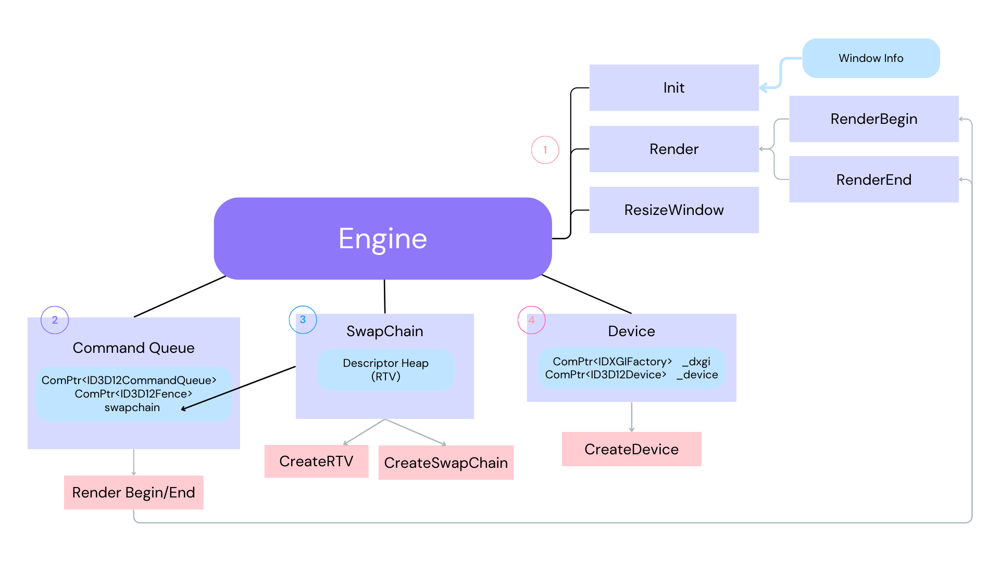
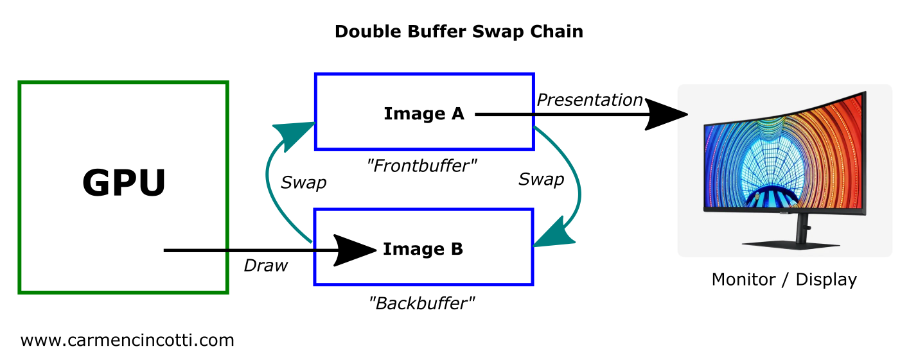

# Base

## 메인 루프

엔진이 탑재되는 메인 루프 부분.

```cpp
while (true)
    {
        if (PeekMessage(&msg, nullptr, 0, 0, PM_REMOVE)) { //메세지 큐에서 순차적으로 꺼내 사용
            if (msg.message == WM_QUIT)
                break;

            if (!TranslateAccelerator(msg.hwnd, hAccelTable, &msg))
            {
                TranslateMessage(&msg);
                DispatchMessage(&msg);
            }
        }
        //TODO : 게임 로직
        game->Update();
    }

    return (int) msg.wParam;
```
기존 `GetMessage` 는 메세지 수신 전까지 루프가 정지하는 방식이기 때문에, 메시지 유무 확인만 하고 루프가 계속되는 `PeekMessage`를 사용.

## DLL vs Lib

라이브러리는 크게 정적 라이브러리와 동적 라이브러리가 있다.두 라이브러리의 가장 큰 차이점은 실행파일에 링킹되는 시점이다.
* 정적라이브러리 의 경우 **컴파일**시 실행 파일로 복사된다.
* 동적라이브러리 의 경우 obj 파일 생성시 복사되었던 모듈의 주소값을 **런타임**시 접근한다.

본 프로젝트에서는 lib 형태로 엔진을 생성한다.

## Engine 기초 구성



1. 기본요소들은 엔진의 초기화, 렌더 시작, 렌더 종료 부분, 화면 조정 부분으로 구성. </br>렌더링 부분은 Render Begin -> 물체를 그리는 예약 작업 -> Render End 의 흐름

2. `Command Queue` : GPU에 일을 요청시에, 일감을 기록했다가 한방에 요청하는것 ( 하나씩 요청하면 비효울적 임으로)
    * `CommandQueue` : 일감의 공간 할당, 일감의 리스트 저장, 큐 작동
    * `Fence` : CPU, GPU 작업 동기화를 위한 블락 도구. Fence val 을 기준으로 대기할 일감의 번호를 나타냄.
    * `Init` : 
    ```cpp
            void CommandQueue::Init(ComPtr<ID3D12Device> device, shared_ptr<SwapChain> swapChain)
        {
            _swapChain = swapChain;

            D3D12_COMMAND_QUEUE_DESC queueDesc = {};
            queueDesc.Type = D3D12_COMMAND_LIST_TYPE_DIRECT;
            queueDesc.Flags = D3D12_COMMAND_QUEUE_FLAG_NONE;

            device->CreateCommandQueue(&queueDesc, IID_PPV_ARGS(&_cmdQueue));

            // - D3D12_COMMAND_LIST_TYPE_DIRECT : GPU가 직접 실행하는 명령 목록
            device->CreateCommandAllocator(D3D12_COMMAND_LIST_TYPE_DIRECT, IID_PPV_ARGS(&_cmdAlloc));

            // GPU가 하나인 시스템에선 0으로
            // DIRECT or BUNDLE
            // Allocator
            // 초기상태 (그리기 명령은 nullptr 지정)
            device->CreateCommandList(0, D3D12_COMMAND_LIST_TYPE_DIRECT, _cmdAlloc.Get(), nullptr, IID_PPV_ARGS(&_cmdList)); // 1)

            // CommandList는 Close / Open 상태가 있는데
            // Open 상태에서 Command를 넣다가 Close한 다음 제출하는 개념
            _cmdList->Close(); // 2)

            // CreateFence
            // - CPU와 GPU의 동기화 수단으로 쓰인다.
            device->CreateFence(0, D3D12_FENCE_FLAG_NONE, IID_PPV_ARGS(&_fence));
            _fenceEvent = ::CreateEvent(nullptr, FALSE, FALSE, nullptr); //event : 신호등 
        }
    ```
    1) 백터의 내용을 날려도 할당된 capacity 가 남아있는것 처럼 **list에 allocator 로 할당한 공간**을 활용한다.
    2) 커맨드 큐의 일감 삽입이 **list open** -> **command 삽입** -> **list close** 후 제출의 흐름인 것을 기억하자.
    * `Render Begin/End` : Engine의 Render begin/end 기능은 사실상 여기를 호출하는것.
        * Render Begin : clear -> viewport/sissor rect reset -> backbuffer 알려줌 
        * Render End :  backbuffer를 frontbuffer로 -> list 닫음 -> cmdqueue 실행 -> 출력(swapchain present) -> swapIndex 


3. `SwapChain` :  현재 게임 세상에 있는 상황을 묘사하고 어떤 공식으로 어떻게 계산할지 GPU에 던져줌. GPU가 열심히 계산 (외주) 후 결과물 받아서 화면에 그려준다. 그런데 [외주 결과물]을 어디에 받지?
 - 어떤 종이(Buffer)에 그려서 건내달라고 부탁해보자
 - 특수 종이를 만들어서 -> 처음에 건내주고 -> 결과물을 해당 종이에 받는다 OK
    * 버퍼링 : 
        - 
        - 우리 화면에 특수 종이(`rendertarget`) 출력해준다
        - 그런데 화면에 현재 결과물 출력하는 와중에, 다음 화면도 외주를 맡겨야 함
        - 현재 화면 결과물은 이미 화면 출력에 사용중
        - 특수 종이를 2개 만들어서, 하나는 현재 화면을 그려주고, 하나는 외주 맡기고...
        - Double Buffering!
         ```cpp
        void SwapChain::SwapIndex()
        {
            _backBufferIndex = (_backBufferIndex + 1) % SWAP_CHAIN_BUFFER_COUNT; //1과0 번갈아가며 바뀜
        }
        ```

    * `DescriptorHeap` (=view) : Dx12 부터 생긴 개념. dx11 의 view 와 일맥상통. 일종의 기안서. 각종 리소스를 어떤 용도로 사용하는지 적어서 넘겨주는 용도. 이걸로 `RTV`(Render Target View) 를 생성하고. 이는 dx11의 DSV,CBV,SRV,UAV 를 전부 통틀은 개념이라 보면 됨.
   

4. `Device` : 일종의 **인력사무소**로 생각하면됨. 화면 객체의 생성, 화면 관련 기능을 담당.
    * `ComPtr`: COM(Component Object Model) 은 DX의 프로그래밍 언어 독립성과 하위 호환성을 가능하게 하는 기술로 COM 객체(COM 인터페이스)를 사용. 세부사항은 우리한테 숨겨짐. ComPtr은 일종의 그 스마트 포인터
    * `CreateDevice`:  `DXGI`(DirectX Graphics Infrastructure) Direct3D와 함께 쓰이는 API, 화면 관련 조정 담당과
    `Device` 디스플레이 어댑터(그래픽 카드)를 나타내는 객체. 
    
        이 두가지 요소를 사용하여 CreateDevice 가 작동된다.
